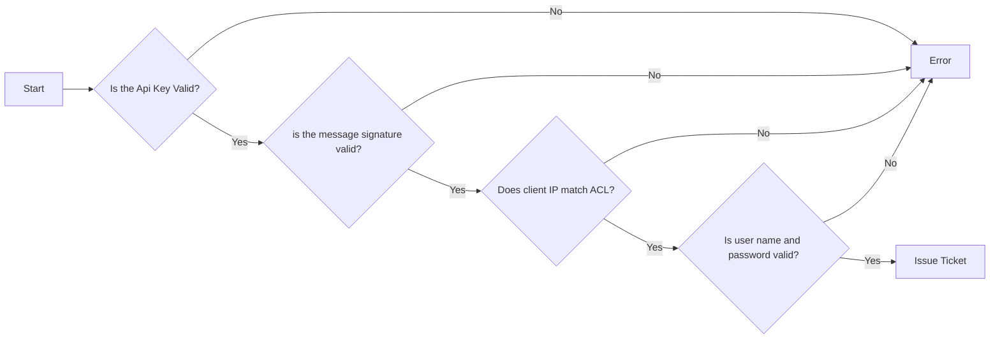

# Security

This document describes the basics of how security is implemented in the DucksFeet API, or, dfapi.

## Overview

The security for dfapi was designed to be robust and based on well vetted, standard, encryption technologies. 

The channel of information flow between client and server is encrypted by SSL The preferred mode of operation is over [Tailscale](https://www.tailscale.com) (much of the code assumes [Tailscale](https://www.tailscale.com)) there is an end to end encrypted conversation. All of the authentication data is generated based on standard libraries and best practices.

The [Ticket](#tickets) are primary object in dfapi. Tickets are short-lived and expire after 600 seconds. Along with the ticket is session data. This can be any JSON serializable type. This data expires at the same time as the ticket.

This creates a secure session for API access. The path to acquiring a ticket
it a multi-tiered approach for authentication and security. These layers are important to prevent not only unauthorized access but session hijacking.

## Authorization Flowchart



## Api Key

The apikey is a pre-shared key in the form of a bearer token. This token is defined in server.ini but is static. This is not a very strong security mechanism.

## Message Signature

If the message is signed, indicated by the headers in `X-DfApi-Signed-With: {uuid}` and `X-DfApi-Signature={base64 signature}` the payload data is checked against the signature and when and must be valid.

## Network ACL

Network access is controlled via an ACL. The ACL's properties are:

* *allow*  - A list of ip addresses or CIDR net masks to match for access.
* *deny*  - A list of ip addresses or CIDR net masks to match to deny access.
* *policy* - 'deny' or 'allow' to set the ACL policy.

When the ACL policy is set to `*allow*' the deny list is checked to see if the
client IP address is to be denied. If it is set to '*deny*' the client IP address must match the allow list.

### Example ACL

This is a simple [Tailscale](https://www.tailscale.com) ACL which would match most casual [Tailscale](https://www.tailscale.com) user's network.

```json
 {
    "allow": [ "100.64.0.0/10" ],
    "deny": [ "0.0.0.0/0" ],
    "policy": "deny"
}
```

## User Credentials

Users must be authenticated for [ticket](#tickets) issuance. Users are store in the database and their passwords are matched against a password hash. 

## Tickets

The ticket is the primary security object. Once all the other prerequisites are met, a ticket is issued. This ticket lives for a short time and is used to maintain access without a noisier credential matching exchange. The ticket is associated with a user without mainlining or exposing credentials and can be queried for the roles of the user for whom the ticket is issued. Tickets are passed from client to server and server to client asa cryptographically unique string.

Tickets are bound to the client IP address so that a stolen ticket id is meaningless on another machine.

## Message Signatures

If `config.auth.x509verify` is true and the plugin has no set `no_ticket_ok` to True each
message is  

Messages are meant to be signed with an X509 2048 RSA public and private key pair. This signing and verification is based on

| Header               | Usage                                                    |
|--------------------- | -------------------------------------------------------- |
| X-DFApi-Request-Id.  | The client supplied request ID                           |
| X-DfApi-Signed-With  | Contains the UUID of the key used to sign the request_id |
| X-DfApi-Signature    | The signature of the request ID.                         |

The keys are generated, on each node, by the systemd dfapi-x509 timer/service units. Periodically a new key pair is generated, with a new UUID. This uuid is used for a mongo ticketStore.pki document. The public key generated is stored there with the node name. The public key can be retrieved via the uuid as the `_id` property. At the end of the process a file, `keystore.json`, in the keystore directory is atomically written with the new uuid and the name of the private key file.

In order for a request to be verified when x509verify is True the public key referenced with the UUID is loaded from the database. The client node name, resolved from the client IP address, is checked against the record for the key in the database. If the node name does not match, the signature is invalid. The signature of the request ID must cryptographically match the passed signature.

This process keeps the key generation logic outside of the API modules and ensures that it's usable by both client and server code.

By using the dfRequest wrapper on the server side to validate messages, only validated messages are passed along to the API module request handler. This transparent, to the API module, security mechanism allows for the server to know the client connecting is known and authorized.

The `ticketStore.pki` collection has a TTL index of 2 days, so, this prevents any overlap of old key id's and new ones, while keeping the database from overfilling. The `dfapi-x509` service will also trim the keystore so that it doesn't accumulate too many key files either.

## Client API/CLI

For the client to work with x509 certificates it needs the x509 service running with `certtool.py` installed in `~/bin/dfapi-tools`. The services runs as a timer/service pair template unit, so
it must be enabled with `systemctl enable --now dfapi-x509@$USER`. These operations are done with the CLI setup.sh tool.

For more details on the CLI tool please read [CLI Tool](/docs/cli.md).
